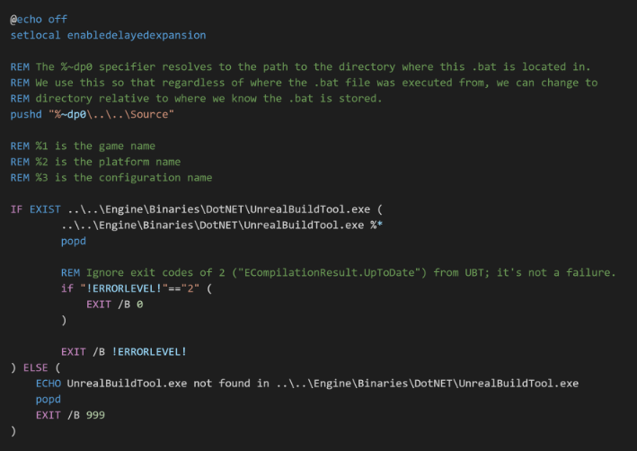
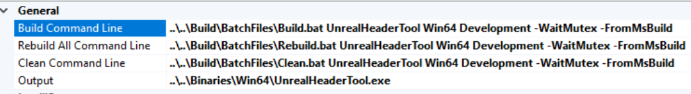
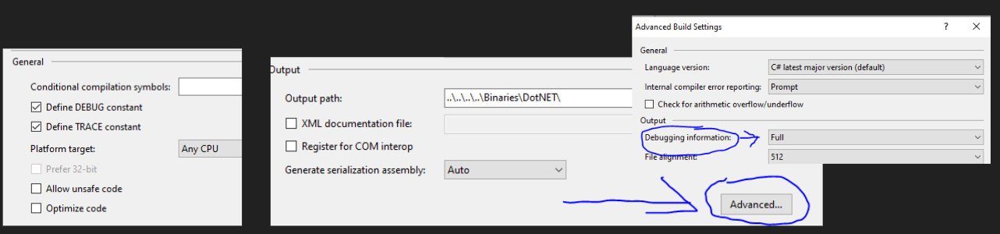
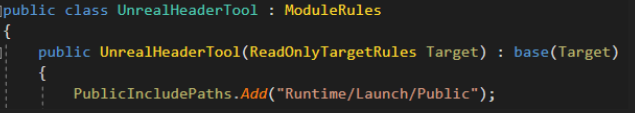

# compiling-unreal

A man's notes as he discovers how Unreal Engine compiles things

## Support

If you have gotten any use out of this, please consider becoming one of my [GitHub Sponsors](https://github.com/sponsors/Allar). Even a $1 is very appreciated.

## No Warranty

I make no claims that any of this information is accurate, correct, or relevant in any way. It definitely won't ever be completed.

## Licensing

This is GPL v3 because it is not ready for MIT.

## Build Pipeline Tools

* Build Scripts
  * Build.bat
* DotNETUtilities
* UnrealBuildTool
* UnrealHeaderTool

## Build Scripts — Build.bat

* Wrapper for UnrealBuildTool.exe
* Ensures that the current working directory is set to the Engine’s Source folder
* Checks to see if UnrealBuildTool.exe exists and errors out if it doesn’t
* Otherwise just passes all command line args to UnrealBuildTool.exe

## DotNETUtilities

* Provides general utilities for all DotNET tools for Unreal Engine
* Contains things like:
  * A JSON library
  * A library for working with Perforce
  * File Handling
  * Logging
  * Process management and queuing
  * Command Line Arg Processing

## Visual Studio Notes

* Project files generated in Engine\Intermediate\ProjectFiles
* This also appears to be the working directory for NMake/Build commands

### How To Debug UnrealBuildTool in the Development Editor Configuration

* Why would you want to debug while using the `Development Editor` configuration?
  * I am hella lazy and I don’t want to keep toggling that `Debug` box
* Do the following to DotNETUtilities and UnrealBuildTool:
  * In Project Build Properties: Define DEBUG Constant, Disable Optimize Code
  * Set `Debugging Information` in the `Output Advanced` window to `Full`
* Use Entrian Attach to attach to `Engine\Binaries\DotNET\UnrealBuildTool.exe`
  * Otherwise start up the UnrealBuildTool project using command line args like: `UnrealHeaderTool Win64 Development -WaitMutex -FromMsBuild`

# UnrealBuildTool

The following section is centered on the mechanisms specific to the UnrealBuildTool.

## Building a Target

When you right-click a project in Visual Studio and click Build, this is ultimately what you're doing.

Visual Studio calls the Build.bat script with command-line arguments representing your desired build target. It does this in the form of:

`Build.bat TargetName TargetPlatform Configuration OptionalAdditionalArgs`

For example, when building the UnrealHeaderTool directly, you invoke:

`Build.bat UnrealHeaderTool Win64 Development -WaitMutex -FromMsBuild`

Fun fact: `-FromMsBuild` means use MSBuild Message Format for warnings and errors, which is a format that Visual Studio understands allowing for navigating directly to the error. That format takes the form of the following DotNet Regular Expression:

`(?'FILENAME'.+):(?'LINE'\d+):(?'COLUMN'\d+): (?'CATEGORY'error|warning): (?'TEXT'.*)`

## Important Objects To Know About

Feel free to skip this list and come back to it when you come across an object term or type you don't know. It'll hopefully be in here.

#TODO: Make a table of contents that links to the right shit

* SingleInstanceMutexes

### SingleInstanceMutexes

UnrealBuildTool uses `SingleInstanceMutexes` to ensure that no two UnrealBuildTool instances are going to stomp each other and compete for the same resources. This uses DotNet Mutexes that are named based on your Engine instance, so you can compile two different Engines at once, but you can't build two targets within the same Engine simultaneously.

* `SingleInstanceMutex(string MutexName, bool bWaitMutex)`
  * Creates Mutexes with formatted string: `Global\\{0}_{1}`
    * {0}: Mutex Name
    * {1}: DotNet String `GetHashCode()`
    * i.e. `Global\UnrealBuildTool_Mutex_XmlConfig_-2108754181`
* Used Mutex Names:
  * `UnrealBuildTool_Mutex_XmlConfig`, `Assembly.GetExecutingAssembly().CodeBase`
    * Used when reading `XmlConfig` files on UnrealBuildTool startup
  * `UnrealBuildTool_Mutex`, `Assembly.GetExecutingAssembly().CodeBase`
    * Used when actually building
  * `UnrealBuildTool_WriteMetadata`, `UnrealBuildTool.RootDirectory.FullName`
    * Used when UnrealBuildTool runs UnrealBuildTool in WriteMetaData mode as part of a build so that DebugGame and DevelopmentEditor `.module` files can be written in parallel

### XMLConfigFiles

The UnrealBuildTool can be configured in many ways. One of them is through configuration files in `.xml` form. These are generally global configuration options that affect the entire build pipeline as opposed to settings you might want to be passed to tools via command-line. Like Unreal's .ini configuration system, there are multiple sources and layers to XMLConfigFiles.

#### XML Config Cache Validation

1. Skipped if XMLConfigCache= is passed
1. Non-Installed Engine, DefaultConfigFile is `Engine\Saved\UnrealBuildTool\BuildConfiguration.xml`
1. Installed Engine DefaultConfigFile is `%localappdata%\UnrealEngine\XmlConfigCache-(EnginePath).bin`
1. Global AppData override of UnrealBuildtool Configuration: `%APPDATA%\Unreal Engine\UnrealBuildTool\BuildConfiguration.XML`
1. Global Documents override of UnrealBuildtool Configuration?: `My Documents\Unreal Engine\UnrealBuildTool\BuildConfiguration.XML`
1. Reads XML Schema: `Engine\Saved\UnrealBuildTool\BuildConfiguration.Schema.xsd`
1. Checks to see if XMLConfigCache is up to date (`UnrealBuildTool_Mutex_XmlConfig`) 
    1. Checks to see if UnrealBuildTool’s executable is newer than cache, if so, rebuild cache
    1. Checks to see if config files in cache’s timestamps are newer than cache timestamp as well as a schema validation check
    1. If not, generates a `Dictionary<string (CategoryName), Dictionary<string (FieldName), FieldInfo>>` of all UnrealBuildTool C# types that have a field marked `XMLConfigFileAttribute`
        1. Non-installed engines will write out schema
        1. All XML files in the config cache listed above are read and validated against the schema
        1. All config values saved in the config cache file

### UnrealBuildTool's Config Hierarchy / Config Layers

#### Practical Knowledge

* {TYPE} refers to a Config Type Name that is passed in when merging config files. The “Engine” or “Game” or “Editor” or “Input” in DefaultEngine/DefaultGame/DefaultEditor/DefaultInput.ini
* Platform becomes a config suitable name like “Windows” and is not the same as a Target Platform name which we’ll see later “Win64”
* Note: All paths with Platform in them will first check to see if Engine\Platforms\PlatformName exists before looking into the normal Engine/Config/Platform folder. This allows for easier NDA and “add on” platform extensions, both config wise and code/content wise.
* Projects with Platform can also be extended in this way with their extensions in Project\Platforms instead of Engine\Platforms

1. Non-User Specific Settings
    Path | Notes
    ---- | -----
    Engine/Base.ini	                        | Empty, but required to exist |
    Engine/Base{TYPE}.ini                   |
    Engine/Platform/BasePlatform{TYPE}.ini  | i.e. Engine/Windows/BaseWindows*.ini
    Project/Default{TYPE}.ini               | i.e. see image to the right
    Engine/Platform/Platform{TYPE}.ini      | i.e. Engine/Windows/Windows*.ini
    Project/Platform/Platform{TYPE}.ini     | i.e. Project/Windows/Windows*.ini
1. User Specific Settings
    Path | Notes
    ---- | -----
    UserSettings/.../User{TYPE}.ini         | This no longer exists? i.e. AppData/Local/Unreal Engine/Engine/Config/UserEngine.ini
    UserDir/.../User{TYPE}.ini              | This no longer exists? i.e. Documents/Unreal Engine/Engine/Config/UserEngine.ini
    Project/User{TYPE}.ini                  | i.e. Project/User*.ini

#### Technical Knowledge

This is how the Config paths are generated.

##### Tokens

* `{ENGINE}` = Absolute path to the Engine
  * D:\UE425\Engine
* `{PROJECT}` = Absolute path to Project
* `{PLATFORM}` = See slide on Platform
* `{TYPE}` = Requested .ini type
  * Engine, Game, Input, etc.
* `{EXTENGINE}` = Extension folder
  * Used if exists, otherwise Engine
* `{USERSETTINGS}` = LocalAppData/Roaming
* `{USER}` = User My Documents folder
  * Expansion Tags (out of the box stock engine):
* `{ED}` = Directory Prefix
  * Note the /
* `{EF}` = File Prefix

Any path with {ED} or {EF} gets thrown into an ConfigLayerExpansion loop. Within that loop, any path with {PLATFORM} gets thrown into a DataDerivedPlatformInfo loop.

1. Non-User Specific Settings
    Path | Notes
    ---- | -----
    {ENGINE}/Base.ini                       |
    {ENGINE}/{ED}{EF}Base{TYPE}.ini         |
    {ENGINE}/{ED}{PLATFORM}/{EF}Base{PLATFORM}{TYPE}.ini  | But use extension folder if it exists: {EXTENGINE}/{ED}{EF}Base{PLATFORM}{TYPE}.ini
    {PROJECT}/{ED}{EF}Default{TYPE}.ini     |
    {ENGINE}/{ED}{PLATFORM}/{EF}{PLATFORM}{TYPE}.ini  | But use extension folder if it exists: {EXTENGINE}/{ED}{EF}{PLATFORM}{TYPE}.ini
    {PROJECT}/{ED}{PLATFORM}/{EF}{PLATFORM}{TYPE}.ini | But use extension folder if it exists: {EXTPROJECT}/{ED}{EF}{PLATFORM}{TYPE}.ini
1. User Specific Settings
    Path | Notes
    ---- | -----
    {USERSETTINGS}/Unreal Engine/Engine/Config/User{TYPE}.ini |
    {USER}/Unreal Engine/Engine/Config/User{TYPE}.ini |
    {PROJECT}/User{TYPE}.in |

##### Expansion Loop

1. If config format has either `{ED}` or `{EF}` in it, it runs through `ConfigLayerExpansions` which allow for additional overrides
1. All config files with expansion tags run through entire array of the following `ED` (Directory), `EF` (File) pairs. i.e. `{ENGINE}/Config/{ED}{EF}BaseEngine.ini`
    {ED} | {EF} | Example
    ---- | ---- | -------
    | | | Engine/Config/BaseEngine.ini
    | | Shippable | Engine/Config/ShippableBaseEngine.ini
    NotForLicensees/ | | Engine/Config/NotForLicensees/BaseEngine.ini
    NotForLicensees/ | Shippable | Engine/Config/NotForLicensees/ShippableBaseEngine.ini
    NoRedist/ | | Engine/Config/NoRedist/BaseEngine.ini
    NoRedist/ | Shippable | Engine/Config/NoRedist/ShippableBaseEngine.ini
1. If config path has a {PLATFORM} tag within it, for every Expansion iteration we also perform Platform lookup.
    1. Fetch DataDrivenPlatformInfo
        1. In non-extension platform folders, i.e. Engine/Config/Windows/, there exists a DataDrivenPlatformInfo.ini which is used to defining various platform configurations and targets. That platform name the .ini is loaded for is the file’s parent folder: `Engine/Config/Windows/DataDrivenPlatformInfo.ini`, platform = Windows
        1. In extension platform folders, same logic, platform name is two folders up: `Engine/Platforms/Windows/Config/DataDrivenPlatformInfi.ini`, platform = Windows
    1. UnrealBuildTool only loads the following information per platform:
        1. bIsConfidential
        1. AdditionalRestrictedFolders (an array of strings)
        1. IniParentChain (an array of strings)
            1. If IniParentChain is not null, platform ini’s loaded from most generic to most specific, with most specific being our current active platform
            1. Unix then Linux i.e. `Engine/Unix/BaseUnixEngine.ini, then Engine/BaseLinuxEngine.ini`
            1. Unix then Arch64Linux
            1. Android then Lumin
            1. IOS then TVOS i.e. `Engine/IOS/BaseIOSEngine.ini, then Engine/TVOS/BaseTVOSEngine.ini`

##### Full List of Config Files

These are all the config files loaded for `Linux` for config type `Engine`. This process is repeated for `Game`, `Input`, etc... 

`Linux` does not use the platform extension folder, which would change Engine config paths from `Engine\Config\PlatformName` to `Engine\Platforms\PlatformName\Config`.

1. Engine/Base.ini
1. Engine/BaseEngine.ini
1. Engine/ShippableBaseEngine.ini
1. Engine/NotForLicensees/BaseEngine.ini
1. Engine/NotForLicensees/ShippableBaseEngine.ini
1. Engine/NoRedist/BaseEngine.ini
1. Engine/NoRedist/ShippableBaseEngine.ini
1. Engine/Unix/BaseUnixEngine.ini
1. Engine/Unix/ShippableBaseUnixEngine.ini
1. Engine/Unix/NotForLicensees/BaseUnixEngine.ini
1. Engine/Unix/NotForLicensees/ShippableBaseUnixEngine.ini
1. Engine/Unix/NoRedist/BaseUnixEngine.ini
1. Engine/Unix/NoRedist/ShippableBaseUnixEngine.ini
1. Engine/Linux/BaseLinuxEngine.ini
1. Engine/Linux/ShippableBaseLinuxEngine.ini
1. Engine/Linux/NotForLicensees/BaseLinuxEngine.ini
1. Engine/Linux/NotForLicensees/ShippableBaseLinuxEngine.ini
1. Engine/Linux/NoRedist/BaseLinuxEngine.ini
1. Engine/Linux/NoRedist/ShippableBaseLinuxEngine.ini
1. Project/DefaultEngine.ini
1. Project/ShippableDefaultEngine.ini
1. Project/NotForLicensees/DefaultEngine.ini
1. Project/NotForLicensees/ShippableDefaultEngine.ini
1. Project/NoRedist/DefaultEngine.ini
1. Project/NoRedist/ShippableDefaultEngine.ini
1. Engine/Unix/UnixEngine.ini
1. Engine/Unix/ShippableUnixEngine.ini
1. Engine/NotForLicensees/Unix/UnixEngine.ini
1. Engine/NotForLicensees/Unix/ShippableUnixEngine.ini
1. Engine/NoRedist/Unix/UnixEngine.ini
1. Engine/NoRedist/Unix/ShippableUnixEngine.ini
1. Project/Unix/Unix/Engine.ini
1. Project/Unix/ShippableUnixEngine.ini
1. Project/NotForLicensees/Unix/UnixEngine.ini
1. Project/NotForLicensees/Unix/ShippableUnixEngine.ini
1. Project/NoRedist/Unix/UnixEngine.ini
1. Project/NoRedist/Unix/ShippableUnixEngine.ini
1. ~~AppData/Local/Unreal Engine/Engine/Config/UserEngine.ini*~~
1. ~~Documents/Unreal Engine/Engine/Config/UserEngine.ini*~~
1. Project/UserEngine.ini

> I believe the two crossed out config files should have been updated to use a newer config method that Unreal Engine uses in which it places config files in versioned folders inside AppData. Maybe this is a bug in the UnrealBuildTool but no one has build settings in their User Data folders so it doesn't matter?

### Global BuildConfiguration Settings

When building, the UnrealBuildTool creates a global BuildConfiguration object that configures all builds. Unless otherwise noted, default is false/null. It can be configured in various ways using both XMLConfigFiles and command-line options.

#TODO Write a script to parse this shit from .xml schema

#### XMLConfigFile Fields

Field | Description
----- | -----------
bIgnoreOutdatedImportLibraries = `true` | Skips checking for outdated import libraries, speeds up iteration time
bUsePrecompiled | Use existing static libraries for all engine modules in this target.
bPrintDebugInfo | Whether debug info should be written to the console.
bLogDetailedActionStats | Whether to log detailed action stats. This forces local execution.
bAllowHybridExecutor  | Whether the hybrid executor will be used (a remote executor and local executor).
bAllowXGE = `true`  | Whether XGE may be used.
bAllowSNDBS = `true`  | Whether SN-DBS may be used.
bUseUBTMakefiles = `true` | See slide about UBT Makefiles
bAllowDistcc  | Whether DMUCS/Distcc may be used.
bAllowParallelExecutor = `true` | Whether to allow using parallel executor on Windows.
MaxParallelActions  | Number of actions that can be executed in parallel. If 0, computes based on available cores
bForceHeaderGeneration  | If `true`, force header regeneration. Intended for the build machine.
bDoNotBuildUHT  | If `true`, do not build UHT, assume it is already built.
bFailIfGeneratedCodeChanges | If `true`, fail if any of the generated header files is out of date.
bAllowHotReloadFromIDE  | `True` if hot-reload from IDE is allowed.
bForceDebugUnrealHeaderTool | If `true`, Debug version of UHT will be built and run instead of the Development version.
MaxRootPathLength = 50  | Maximum recommended root path length.
MaxNestedPathLength = 200	| Max length of a relative path. Windows limit to make paths portable between machines.

#### Command-line Options

Command-line Arg | Description
---------------- | -----------
UsePrecompiled  | Use existing static libraries for all engine modules in this target.	
NoXGE | Disables use of XGE
NoUBTMakefiles  | Disables use of UBT Makefiles
MaxParallelActions  | Number of actions that can be executed in parallel. If 0, computes based on available cores
ForceHeaderGeneration | Forces header regeneration. Intended for the build machine.
NoBuildUHT  | Skips building UnrealHeaderTool, assume that it is already built.
FailIfGeneratedCodeChanges  | Fail if any of the generated header files is out of date.
NoHotReloadFromIDE  | Disables hot reload from IDE
SkipRulesCompile  | Skip compiling rules assemblies and just assume they are valid

### Target Descriptors

A TargetDescriptor describes all of the information needed to initialize a UEBuildTarget object. It is made up of the following:

* ProjectFile: (Can be Null) A file path to a .uproject file that describes project level information about are target.
* Name: A string representing the name of the target
* Platform: This target’s UnrealTargetPlatform i.e. Win32, Win64, LinuxAArch64, Mac, IOS, etc. 
* Configuration: This target’s UnrealTargetConfiguration, i.e. Unknown, Debug, DebugGame, Development, Shipping, Test
* Architecture: A string representing this target’s architecture, usually just an empty string. Appears to be only used on Linux/HoloLens/iOS.
* AdditionalArguments: Command line arguments to use when building this target; aggregate of initial UBT command line args as well as any additional args specified for a target when a TargetList is specified
    Field Name | Command-line Arg | Description
    ---------- | --- | -----------
    ForeignPlugin | -ForeignPlugin | Foreign plugin to compile against this target
    OnlyModuleNames	| -Module= | List of modules to *only* build
    SingleFileToCompile |	-SingleFile= | File path to the only file that should be compiled
    HotReloadMode	| -NoHotReload, -ForceHotReload, -LiveCoding | Sets mode for Hot Reloading
    WriteActionFiles |-WriteActions= | Export the actions for the target to a file
    LiveCodingModules | -LiveCodingModules=	| Path to a file containing a list of modules that may be modified for live coding
    LiveCodingManifest | -LiveCodingManifest=	| Path to the manifest for passing info about the output to live coding
    bQuiet | -Quiet | Suppress messages about building this target

#### Example: Building UnrealHeaderTool Target Descriptor

Building the UHT, this is the initial UBT command line `UnrealHeaderTool Win64 Development -WaitMutex -FromMsBuild`

Goal is to build a `TargetDescriptor`, which requires: `ProjectFile` (Can be Null), `TargetName`, `Platform`, `Configuration`, `Architecture`, `Arguments`

1. Skips Target List processing as `-TargetList`/`-Target` are not provided, go right into parsing this command line as a `TargetDescriptor`
1. ProjectFile set as `null`
1. Determines `Platform` is `Win64`
1. Determines `Configuration` is `Development`
1. Determines UnrealHeaderTool as the `TargetName`
1. Uses default `Architecture` for Win64, which is an empty string “”
1. Scan for any `ProjectFiles` that match this target, which there are none of, so `ProjectFile` remains null
1. `-WaitMutex` and `-FromMSBuild` added as additional commandline arguments for this target
1. `TargetDescriptor` fully built

### Engine BuildVersion

A BuildVersion class describes all the versioning info for any given UE4 Engine.

Always located in `Engine\Build\Build.version` in `JSON` format.

Includes the following information:

Field Name | Description
---------- | -----------
MajorVersion | Is always 4 (the 4 in UE4)
MinorVersion | At time of writing, this is 25, as in 4.25
PatchVersion | At time of writing, this is .0, even though I’m using Preview 3
Changelist | GitHub Releases this should be 0
CompatibleChangelist | GitHub Releases this should be 0
IsLicenseeVersion | `True` if using your own versioning on top of UE4’s versioning?
IsPromotedBuild | `True` if build is a marked good build from a ‘clean sync’ of a specific changelist
BranchName | Name of the branch, i.e. ++UE4+Release-4.25, based on source GitHub/Perforce branch
BuildId | Current build id. Generated automatically when Engine binaries change if not set in BuildVersion
BuildVersion | Stored as BuildVersionString. Unique string identifying this target and engine, updated via AutomationTool

### UEBuildTarget Object

A UEBuildTarget contains all the information needed to build a target. This is required to generate a Makefile.

Field Name | Description
---------- | -----------
Rules | The target rules
`RulesAssembly` | The rules assembly to use when searching for modules
MetadataCache | Cache of source file metadata for this target
ProjectFile | The project file for this target
ProjectDescriptor | The project descriptor for this target
TargetType | Type of target
AppName	| Name of the application the target is part of. If bUseSharedBuildEnvironment = `true`, typically “UE4Editor” for editors
TargetName | The name of the target
bUseSharedBuildEnvironment | Whether target uses shared build environment. If false, all binaries should be written to the project directory.
Platform | Platform as defined by the VCProject and passed via the command line. Not the same as internal config names.
Configuration | Target as defined by the VCProject and passed via the command line. Not necessarily the same as internal name.
PlatformIntermediateFolder | Relative path for platform-specific intermediates (eg. Intermediate/Build/Win64)
ProjectDirectory | Root directory for the active project. Typically contains the .uproject file, or the engine root.
ProjectIntermediateDirectory | Default directory for intermediate files. Typically underneath ProjectDirectory.
EngineIntermediateDirectory | Directory for engine intermediates. Monolithic builds will be the project intermediate directory.
bHasProjectScriptPlugin	| Identifies whether the project contains a script plugin. This will cause UHT to be rebuilt, even in installed builds.
BuildPlugins | All plugins which are built for this target
EnabledPlugins | All plugin dependencies for this target.
ForeignPlugin | Specifies the path to a specific plugin to compile.
Binaries | All application binaries; may include binaries not built by this target.
NonFilteredModules | Kept to determine the correct module parsing order when filtering modules.
bCompileMonolithic | `true` if target should be compiled in monolithic mode, false if not
TargetRulesFile | The name of the `.Target.cs` file, if the target was created with one
bDeployAfterCompile |	Whether to deploy this target after compilation

### ModuleRulesContext

Stores information about where a module rules object came from, and how it can be used. 

Field Name | Description
---------- | -----------
RulesScope | The scope for this module. Used to validate references to other modules.
DefaultOutputBaseDir | The default directory for output files
Plugin | The plugin that this module belongs to
bCanHotReload | Whether this module should be included in the default hot reload set
bCanBuildDebugGame | Should module be compiled with optimization off in DebugGame configs (ie. whether it's a game module).
bCanUseForSharedPCH | Whether this module can be used for generating shared PCHs
bClassifyAsGameModuleForUHT | Whether to treat this module as a game module for UHT ordering
DefaultUHTModuleType | The default module type for UnrealHeaderTool. Do not use this for inferring other things about the module.

### `RulesAssembly` Object

The most practical way to think of a `RulesAssembly` Object is to imagine a `.dll` that simply consists of classes defined by a group of Module ``.Build.cs`` files. DotNet C# allows dynamic compilation and loading of `.dlls` (Assemblies). The UnrealBuiildTool uses this mechanism so that Module authors can use C# to programmatically define the build rules for their Modules but not worry about building the UnrealBuildTool assemblies that are made up of all engine and project module build rules. The `RulesAssembly` Object is essentially a bunch of metadata about these `.dlls` as well as a reference to a `.dll`.

The Engine makes use of two `RulesAssembly` Objects.

Rules Assembly | Description
-------------- | -----------
UE4Rules.dll | This is an Engine/Enterprise Assembly that contains all the compiled C# ``.Build.cs`` Module build rules in the `Engine`, excluding `Programs`
UE4ProgramRules.dll | This is an Engine/Enterprise Assembly that contains all the compiled build rules for all the Engine Program Targets including `UE4Editor.Target`. This assembly has `UE4Rules.dll` as a parent ``RulesAssembly`` as `Engine Programs` rely on `Engine Modules` and are scoped as such

A `RulesAssembly` stores information about a compiled DotNet C# .dll assembly that contains our assembly’s build rules and the types it contains. When a `RulesAssembly` Object is constructed, it attempts to compile and load a DotNet C# Assembly.

Field Name | Description
---------- | -----------
Scope	| Outers scope for items created by this assembly. Used for chaining assemblies together.
CompiledAssembly | The compiled assembly
BaseDirs | The base directories for this assembly
Plugins | All the plugins included in this assembly
ModuleNameToModuleFile | Maps module names to their actual xxx.Module.cs file on disk
TargetNameToTargetFile | Maps target names to their actual xxx`.Target.cs` file on disk
ModuleFileToContext | Mapping from module file to its context.
ModuleHasSource | Cache for whether a module has source code
bContainsEngineModules | Whether this assembly contains engine modules. Used to set default values for bTreatAsEngineModule.
`DefaultBuildSettings` | Whether to use backwards compatible default settings for module and target rules. This is enabled by default for game projects to support a simpler migration path, but is disabled for engine modules.
bReadOnly | Whether the modules and targets in this assembly are read-only
Parent | The parent rules assembly that this assembly inherits. Game assemblies inherit the engine assembly, and the engine assembly inherits nothing.

#### Compiling and Loading a `RulesAssembly` Object

A ``RulesAssembly`` stores information about a compiled DotNet C# `.dll` assembly that contains our assembly’s build rules and the types it contains.

1. When constructed, consumes a `Scope`, list of base directories (`Engine` + `EngineExt`), list of `PluginInfos`, a dictionary mapping module files to `ModuleRulesContext` objects, list of `TargetFiles` to compile, an assembly name, whether this assembly contains engine modules, a `BuildSettingsVersion` (`V1`, `V2`, `Latest`), whether assemblies readonly, whether to skip compile, and our parent ``RulesAssembly``
1. Builds list of `Assembly` `SourceFileNames` (union between all module and target files)
1. Grab all Preprocessor Definitions (this is the entire list)
    * `WITH_FORWARDED_MODULE_RULES_CTOR`
    * `WITH_FORWARDED_TARGET_RULES_CTOR`
    * `UE_4_{MINORVERSION}_OR_LATER`, i.e. `UE_4_25_OR_LATER`; includes all defines `MinorVersion` `17` and upwards to current
1. `DynamicCompilation` module compiles an `Assembly` consuming `OutputAssemblyPath`, `HashSet` of `SourceFileNames`, a list of `ReferencedAssemblies`, list of preprocessor definitions, whether to not compile, and whether to treat warnings as errors
    1. Load the `Assembly` manifest, same path as `Assembly`, just swap out `.dll` with `Manifest.json`
        1. i.e. `D:\UE425\Engine\Intermediate\Build\BuildRules\UE4RulesManifest.json`
        1. This file appears to be generated with `Generating Project Files (GPF)`
        1. Contains a list of all `Engine` module files (`*`.Build.cs``) and the `Engine` version that it was generated with
    1. If not skipping compiling, check to see whether we require compilation
        1. Consumes `SourceFileNames`, the `Assembly` manifest, and the `Assembly` output path
        1. Require compilation if `Assembly` output file does not exist 
        1. Require compilation if `UnrealBuildTool` is newer than `Assembly`
        1. Require compilation if `Assembly` manifest does not exist (it is generally expected to always exist)
        1. Require compilation if `Engine` version has changed from the manifest `Engine` version
        1. Require compilation if any `Module` source files were added or removed or have a newer timestamp than `Assembly`
    1. If we do not need to compile our assembly, we try to load it
        1. DotNet C# has a built in way of loading Assemblies, simply Assembly.LoadFile(FilePath), if fails, mark for recompile
    1. If we need to compile our assembly, use the DynamicCompilation class to CompileAssembly
        1. Build DotNet CompileParameters
            Parameter | Description
            --------- | -----------
            GenerateInMemory = false | Always compile the assembly to a file on disk
            OutputAssembly = Output Path | This is the full path to the assembly file we're generating
            GenerateExecutable = false | We always want to generate a class library, not an executable
            Treat Warnings as Errors | Supplied as function arg to CompileAssembly
            WarningLevel = 4 | Set the warning level so that we will actually receive warnings
            IncludeDebugInformation = `true` | Always generate debug information as it takes minimal time
        1. Add compiler flag `/optimize` if we aren’t in `DEBUG`
        1. If not supplied any `ReferencedAssemblies`, force referencing `System.dll` and `System.Core.dll`
        1. Otherwise just use our supplied `ReferencedAssemblies`
        1. Always add `UnrealBuildTool` and `DotNETUtilities` as `ReferencedAssemblies`
        1. Add compiler args for preprocessor definitions `/define: `
        1. Use DotNet C# `CSharpCodeProvider` with `CompilerVersion 4.0` to compile our `Assembly` using our `CompileParameters`
        1. Display any warnings or errors, throwing if any errors.
        1. Clean up temporary files.
1. Save out new `Assembly Manifest` file containing all the source files we used to compile our `Assembly`
1. Load `Assembly` into `Application` memory
1. Map `Module Names` to `Module Files` and `Target Names` to `Target Files`
1. Print any `Obsolete` or `Deprecated` code in our ``RulesAssembly`` module build classes

#### Creating the Engine `RulesAssembly` Object

A ``RulesAssembly`` object representing the rules of assembling the `Engine`.

1. Consume `Engine` `RulesScope`, a list of all `Engine` and `Engine Platform Extension` directories, the Assembly Prefix (`UE4`), list of included `Plugins`, whether to use precompiled engine libraries (forced to if using an `Engine` build), whether to skip compiling for this assembly, and any ``RulesAssembly`` parent
1. Add to `RulesScope`: `Engine` -> `Engine Plugins` -> `Engine Programs`
1. Create a default `ModuleRulesContext` to associate with all modules in this assembly
    * Scoped to `Engine`, uses `Engine` directory as `DefaultOutputBaseDir`, shared PCH enabled
1. Builds a dictionary of all shared engine module files excluding the `Programs` directory mapped to a `ModuleRulesContext`
    1. Iterates all consumed root directories, should be the `Engine` directory as well as `Engine Platform Extensions` i.e. `Engine\Platforms\XXX`
        1. Adds all `Engine` modules within `Runtime`, `Developer`, `Editor`, and `ThirdParty` subdirectories within `Source` subdirectory
        1. All modules have a `UHTModuleType` associated with their `Runtime`, `Developer`, `Editor`, or `ThirdParty` location
        1. Grabs the ``.Build.cs`` files of these modules to use when mapping to a `ModuleRulesContext`
        1. 558 total out of the box with UE4.25
    1. Iterates consumed list of `Plugin` directories
        1. Grabs all `Plugin` ``.Build.cs`` files and maps them to a new `ModuleRulesContext` the same as default but scoped to `Engine Plugins`
    1. Determine `OutputAssemblyPath`, default to `Engine` folder i.e. `D:\UE425\Engine`
        1. If `Engine` is installed, use `%LocalAppData%\UnrealEngine\{MajorVersion}.{MinorVersion}` i.e. `...\UnrealEngine\4.25`
    1. Determine ``RulesAssembly`` and `Program`RulesAssembly`` file paths
        1. `OutputAssemblyPath\Intermediate\Build\BuildRules\{AssemblyPrefix}{Program}Rules.{AssemblyFrameworkExtension}`
        1. Example: `D:\UE425\Engine\Intermediate\Build\BuildRules\UE4Rules.dll` and `...\UE4ProgramRules.dll`
    1. Create ``RulesAssembly`` as well as a `Program`RulesAssembly``
    1. Return `Programs`RulesAssembly`` as `Engine` assembly as it contains build rules for both `Engine` Programs and `Engine` Modules

### `TargetRules Object`

Created from a ``RulesAssembly`` object. `TargetRules` is a data structure that contains the rules for defining a target (application/executable). `RequiresUniqueBuildEnvironment` attributes must be shared between all targets when building in a shared build environment.

#TODO: Write a script to generate this shit

All Bold Fields are `RequiresUniqueBuildEnvironment` attributes and must have identical values between all targets when using shared environments.

Internal Field Name             | Config?        | Command-line Arg? | Description
------------------------------- | -------------- | ----------------- | -----------
Name                            |                |                   | The name of this target.
File                            |                |                   | File containing this target
Platform                        |                |                   | Platform that this target is being built for.
Configuration                   |                |                   | The configuration being built.
Architecture                    |                |                   | Architecture that the target is being built for (or an empty string for the default).
ProjectFile                     |                |                   | Path to the project file for the project containing this target.
Version                         |                |                   | The current build version
Type                            |                |                   | The type of target (UnrealBuildTool.TargetType Game, Editor, Client, Server Program)
`DefaultBuildSettings`            |                |                   |	Specifies the engine version to maintain backwards-compatible default build settings with (eg. DefaultSettingsVersion.Release_4_23, DefaultSettingsVersion.Release_4_24). Specify DefaultSettingsVersion.Latest to always use defaults for the current engine version, at the risk of introducing build errors while upgrading.
ConfigValueTracker              |                |                   | Tracks a list of config values read while constructing this target
bUsesSteam                      |                |                   | Whether the target uses Steam.
bUsesCEF3                       |                |                   | Whether the target uses CEF3.
bUsesSlate                      |                |                   | Whether the project uses visual Slate UI (instead of the low level windowing/messaging, which is always available).
**bUseStaticCRT**               |                |                   | Forces linking against the static CRT. This is not fully supported across the engine due to the need for allocator implementations to be shared (for example), and TPS libraries to be consistent with each other, but can be used for utility programs.
**bDebugBuildsActuallyUseDebugCRT** |            |                   |	Enables the debug C++ runtime (CRT) for debug builds. By default we always use the release runtime, since the debug version isn't particularly useful when debugging Unreal Engine projects
bLegalToDistributeBinary        |                |                   | Whether the output from this target can be publicly distributed, even if it has dependencies on modules that are in folders with special restrictions (eg. CarefullyRedist, NotForLicensees, NoRedist).
UndecoratedConfiguration        |                |                   | Specifies the configuration whose binaries do not require a "-Platform-Configuration" suffix.
bBuildAllModules                |                | -AllModules       | Build all the modules that are valid for this target type. Used for CIS / making installed engine builds.
BuildPlugins                    |                | -BuildPlugin=     | Additional plugins that are built for this target type but not enabled.
AdditionalPlugins               |                |                   | 	A list of additional plugins which need to be included in this target. This allows referencing non-optional plugin modules which cannot be disabled, and allows building against specific modules in program targets which do not fit the categories in ModuleHostType.
EnablePlugins                   |                | -EnablePlugin=	   | Additional plugins that should be included for this target.
DisablePlugins                  |                | -DisablePlugin=	 | List of disabled plugins. Project may reference them, so mark as optional to avoid runtime failing.
PakSigningKeysFile              |                |                   | Path to the set of pak signing keys to embed in the executable.
SolutionDirectory               |                |                   | Allows a Program Target to specify its own solution folder path.
bBuildInSolutionByDefault       |                |                   | Whether the target should be included in the default solution build configuration
**bShouldCompileAsDLL**	        |                | -CompileAsDll     | Whether this target should be compiled as a DLL.  Requires LinkType == TargetLinkType.Monolithic.
**ExeBinariesSubFolder**        |                |                   | Subfolder to place executables in, relative to the default location.
GeneratedCodeVersion            |                |                   | Allow target module to override UHT code generation version.
**bEnableMeshEditor**           |                |                   | Whether to enable the mesh editor.
**bCompileChaos**               |                | -NoCompileChaos, -CompileChaos	| Whether to compile the Chaos physics plugin.
**bUseChaos**                   |                | -NoUseChaos, -UseChaos | Whether to use the Chaos physics interface. Disables APEX and NvCloth
**bUseChaosChecked**            |                |                   | Whether to compile in checked chaos features for debugging
**bUseChaosMemoryTracking**     |                |                   | Whether to compile in chaos memory tracking features
**bCustomSceneQueryStructure**  |                |                   | Whether scene query acceleration is done by UE4. The physx scene query structure is still created, but we do not use it.
**bCompilePhysX**               |                |                   | Whether to include PhysX support.
**bCompileAPEX**                | .ini           |                   | Whether to include PhysX APEX support.
**bCompileNvCloth**             |                |                   | Whether to include NvCloth.
**bCompileICU**                 | .ini        	 |                   | Whether to include ICU unicode/i18n support in Core.
**bCompileCEF3**                | .ini        	 |                   | Whether to compile CEF3 support.
**bCompileISPC**                |                |                   | Whether to compile using ISPC.
**bBuildRequiresCookedData**    |                |                   | Compile code related to building assets? Consoles cannot build assets. Desktop platforms can. By default build requires cooked data if target is Game, Client, or Server. Can be overridden in any case.
**bBuildWithEditorOnlyData**    |                |                   | Compile WITH_EDITORONLY_DATA? `True` if type is Editor or Program, can be overridden in any case
**bBuildDeveloperTools**        |                |                   | Whether to compile the developer tools. `True` if compiling against Engine AND (we are either Type Editor, Type Program, or neither Test and Shipping configs)
bForceBuildTargetPlatforms      |                |                   | Whether to force compiling the target platform modules, even if they wouldn't normally be built.
bForceBuildShaderFormats        |                |                   | Whether to force compiling shader format modules, even if they wouldn't normally be built.
**bCompileCustomSQLitePlatform** | .ini          |                   | Compile SQLite using custom "Unreal" platform (`true`), or using native platform (false).
**bUseCacheFreedOSAllocs**      | .ini           |	                 | Whether to utilize cache freed OS allocs with MallocBinned
**bCompileAgainstEngine**       |                |                   | Enabled if including the engine. Disabled when building standalones only linking with Core.
**bCompileAgainstCoreUObject**      |            |                   | Enabled if including CoreUObject. Disabled when building standalones only linking with Core.
**bCompileAgainstApplicationCore**  |            |                   | Enabled for builds that need to initialize the ApplicationCore module.
**bCompileRecast**              | .ini         	 |                   | Whether to compile Recast navmesh generation.
**bCompileSpeedTree**           | .ini           |                   | Whether to compile SpeedTree support.
**bForceEnableExceptions**      |                |                   | Enable exceptions for all modules.
**bUseInlining**                | .xml           |                   | Enable inlining for all modules.
**bForceEnableRTTI**            |                | -rtti             |  Enable RTTI for all modules.
**bWithServerCode**             |                |                   | Compile server-only code. Default `true` except when Type is Client
**bWithPushModel**              |                |                   | When enabled, Push Model Networking will be used on the server. This can help reduce CPU overhead of networking, at the cost of more memory.
**bCompileWithStatsWithoutEngine**  |            |                   | Whether to include stats support even without the engine.
**bCompileWithPluginSupport**	      | .ini       |                   | Whether to include plugin support.
**bIncludePluginsForTargetPlatforms** |          |                   | Whether to allow plugins which support all target platforms. Default `true` if Type is Editor
**bCompileWithAccessibilitySupport**  |          |                   | Whether to allow accessibility code in both Slate and the OS layer.
**bWithPerfCounters**	          | .ini           |                   | Whether to include PerfCounters support.
**bWithLiveCoding**             |                |                   | Whether to enable support for live coding
**bUseDebugLiveCodingConsole**  | .xml           |                   | Whether to enable support for live coding
**bWithDirectXMath**            |                |                   | Whether to enable support for DirectX Math
**bUseLoggingInShipping**       |                |                   | Whether to turn on logging for test/shipping builds.
**bLoggingToMemoryEnabled**     |                |                   | Whether to turn on logging to memory for test/shipping builds.
bUseLauncherChecks              |                |                   | Whether to check that the process was launched through an external launcher.
**bUseChecksInShipping**        |                |                   | Whether to turn on checks (asserts) for test/shipping builds.
**bCompileFreeType**	          | .ini           |                   | `True` if we need FreeType support.
**bCompileForSize**	            | .ini           |                   | `True` if we want to favor optimizing size over speed.
bForceCompileDevelopmentAutomationTests |        |                   | Whether to compile development automation tests.
bForceCompilePerformanceAutomationTests |        |                   | Whether to compile performance automation tests.
**bEventDrivenLoader**          |                |                   | If `true`, event driven loader will be used in cooked builds. @todoio This needs to be replaced by a runtime solution after async loading refactor.
bUseXGEController               | .xml           |                   | Whether the XGE controller worker and modules should be included in the engine build. These are required for distributed shader compilation using the XGE interception interface.
bIWYU                           |                | -IWYU             | Enables "include what you use" by default for modules in this target. Changes the default PCH mode for any module in this project to PCHUsageMode.UseExplicitOrSharedPCHs.
bEnforceIWYU                    |                |                   | Enforce "include what you use" rules; warns if monolithic headers (Engine.h, UnrealEd.h, etc...) are used, and checks that source files include their matching header first.
bHasExports                     |                |                   | Whether the final executable should export symbols. Defaults to `true` if LinkType is Modular
bPrecompile                     |                | -Precompile       | Make static libraries for all engine modules as intermediates for this target.
bEnableOSX109Support            |                |                   | Whether we should compile with support for OS X 10.9 Mavericks.
bIsBuildingConsoleApplication   |                |                   | `True` if this is a console application that's being built.
bBuildAdditionalConsoleApp      |                |                   | Creates an additional console app. Hack for Windows: not possible to conditionally inherit a parent's console Window based on how the app is invoked; have to link the same executable with a different subsystem setting. Default is `true` if Editor
bDisableSymbolCache             |                |                   | `True` if debug symbols that are cached for some platforms should not be created.
bUseUnityBuild                  | .xml           | -DisableUnity	   | Whether to unify C++ code into larger files for faster compilation.
bForceUnityBuild                | .xml           | -ForceUnity	     | Whether to force unify C++ code into larger files for faster compilation. 
bUseAdaptiveUnityBuild          | .xml           |                   | If `true`, use SourceWorkingFileSets to exclude files being iterated on from unity builds
bAdaptiveUnityDisablesOptimizations   | .ini     |                   | Disable optimization for files that are in the adaptive non-unity working set.
bAdaptiveUnityDisablesPCH       | .ini           |                   | Disables force-included PCHs for files that are in the adaptive non-unity working set.
bAdaptiveUnityDisablesPCHForProject   | .ini     |                   | Whether to disable force-included PCHs for project source files in the adaptive non-unity working set. Defaults to bAdaptiveUnityDisablesPCH;
bAdaptiveUnityCreatesDedicatedPCH	    | .ini     |                   | Creates a dedicated PCH for each source file in the working set, allowing faster iteration on cpp-only changes.
bAdaptiveUnityEnablesEditAndContinue  | .ini     |                   | 
MinGameModuleSourceFilesForUnityBuild | .ini     |                   | The number of source files in a game module before unity build will be activated for that module.  This allows small game modules to have faster iterative compile times for single files, at the expense of slower full rebuild times.  This setting can be overridden by the bFasterWithoutUnity option in a module's Build.cs file.
ShadowVariableWarningLevel      |                | -ShadowVariableErrors | Forces shadow variable warnings to be treated as errors on platforms that support it.
UnsafeTypeCastWarningLevel      | .ini           |                   | Indicates what error level to treat unsafe type casts as on platforms that support it
bUndefinedIdentifierErrors      | .ini           |                   | Forces use of undefined identifiers in conditional expressions to be treated as errors.
bUseFastMonoCalls	              | .xml           | -NoFastMonoCalls, -FastMonoCalls |	New Mono drivers have "fast calls" replacing D3d functions
bUseFastSemanticsRenderContexts | .xml           |                   | New Xbox driver supports a "fast semantics" context type.
NumIncludedBytesPerUnityCPP     | .xml           |                   | Approximate number of bytes of C++ code to target for inclusion in a unified C++ file.
bStressTestUnity                | .xml           | -StressTestUnity  | Whether to stress test the C++ unity build robustness by including all C++ files files in a project from a single unified file.
bForceDebugInfo	                |                | -ForceDebugInfo   | Whether to force debug info to be generated.
bDisableDebugInfo               | .xml           | -NoDebugInfo	     | Globally disable debug generation; see DebugInfoHeuristics.cs for config and platform options.
bOmitPCDebugInfoInDevelopment	  | .xml           |                   | Whether to disable debug info on PC in development builds (for faster developer iteration, as link times are extremely fast with debug info disabled).
bUsePDBFiles                    | .xml           | -NoPDB	           | Whether PDB files should be used for Visual C++ builds.
bUsePCHFiles                    | .xml           | -NoPCH	           | Whether PCH files should be used.
bPreprocessOnly                 |                | -PreProcess	     | Whether to just preprocess source files for this target, and skip compilation
MinFilesUsingPrecompiledHeader	| .xml           |                   | Minimum number of files that use a PCH before it will be created and used.
bForcePrecompiledHeaderForGameModules | .xml     |                   | When enabled, a precompiled header is always generated for game modules, even if there are only a few source files in the module.  This greatly improves compile times for iterative changes on a few files in the project, at the expense of slower full rebuild times for small game projects.  This can be overridden by setting MinFilesUsingPrecompiledHeader in a module's Build.cs file.
bUseIncrementalLinking          | .xml           | -NoIncrementalLinking, -IncrementalLinking | Whether to use incremental linking or not. Incremental linking can yield faster iteration times when making small changes. Currently disabled by default because it tends to behave a bit buggy on some computers (PDB-related compile errors).
bAllowLTCG                      | .xml           | -LTCG             | Whether to allow the use of link time code generation (LTCG).
bPGOProfile                     | .xml           | -PGOProfile	     | Whether to enable Profile Guided Optimization (PGO) instrumentation in this build.
bPGOOptimize                    | .xml           | -PGOOptimize	     | Whether to optimize this build with Profile Guided Optimization (PGO).
bAllowASLRInShipping            | .xml           |                   | Use of ASLR (address space layout randomization) if supported. Applies to shipping.
bSupportEditAndContinue         | .xml           |                   | Whether to support edit and continue.  Only works on Microsoft compilers.
bOmitFramePointers              | .xml           |                   | Whether to omit frame pointers or not. Disabling is useful for e.g. memory profiling on the PC.
bUseMallocProfiler              | .xml           |                   | Enable memory profiling, sets USE_MALLOC_PROFILER=1 and forces bOmitFramePointers to false.
bUseSharedPCHs                  | .xml           | -NoSharedPCH      | Enables "Shared PCHs", a feature which significantly speeds up compile times by attempting to share certain PCH files between modules that UBT detects is including those PCH's header files.
bUseShippingPhysXLibraries      | .xml           |                   | `True` if Development and Release builds should use the release configuration of PhysX/APEX.
bUseCheckedPhysXLibraries       | .xml           |                   | `True` if Development and Release builds should use the checked configuration of PhysX/APEX.
bCheckLicenseViolations         | .xml           |                   | Tells the UBT to check if module currently being built is violating EULA.
bBreakBuildOnLicenseViolation   | .xml           |                   | Tells the UBT to break build if module currently being built is violating EULA.
bUseFastPDBLinking	            | .xml           | -FastPDB          | Whether to use the :FASTLINK option when building with /DEBUG to create local PDBs on Windows. Fast, but currently seems to have problems finding symbols in the debugger.
bCreateMapFile                  | .xml           | -MapFile	         | Outputs a map file as part of the build.
bAllowRuntimeSymbolFiles        | .xml           |                   | `True` if runtime symbols files should be generated as a post build step for some platforms. These files are used by the engine to resolve symbol names of callstack backtraces in logs.
BundleVersion                   |                | -BundleVersion	   | Bundle version for Mac apps.
bDeployAfterCompile	            |                | -SkipDeploy, -Deploy | Whether to deploy the executable after compilation on platforms that require deployment.
bAllowRemotelyCompiledPCHs      | .xml           |                   | When enabled, allows XGE to compile pre-compiled header files on remote machines.  Otherwise, PCHs are always generated locally.
bCheckSystemHeadersForModification | .xml        |                   | Whether headers in system paths are checked for modification when determining outdated actions.
bDisableLinking                 |                | -NoLink           | Whether to disable linking for this target.
bFormalBuild                    |                | -Formal           | Indicates that this is a formal build, intended for distribution. Largely useless.
bFlushBuildDirOnRemoteMac	      | .xml           | -FlushMac	       | Whether to clean Builds directory on a remote Mac before building.
bPrintToolChainTimingInfo	      | .xml           | -Timing           | Whether to write detailed timing info from the compiler and linker.
bParseTimingInfoForTracing      |                | -Tracing          | Whether to parse timing data into a tracing file compatible with chrome://tracing.
bPublicSymbolsByDefault	        | .xml           | -PublicSymbolsByDefault | Whether to expose all symbols as public by default on POSIX platforms
ToolChainName                   |  	             | -ToolChain        | Overrides toolchain for this target. Must match name of a class in the UBT assembly.
bDisableUnverifiedCertificates  |                |                   | Whether to allow engine configuration to determine if we can load unverified certificates.
bAllowGeneratedIniWhenCooked    |                |                   | Whether to load generated ini files in cooked build, (GameUserSettings.ini loaded either way)
bAllowNonUFSIniWhenCooked       |                |                   | Whether to load non-ufs ini files in cooked build, (GameUserSettings.ini loaded either way)
bLegacyPublicIncludePaths       |                |                   | Add all the public folders as include paths for compiling. `True` if older than V2 BuildSettings
CppStandard                     |  	             | -CppStd           | Which C++ standard to use for compiling this target. Can be Default, Cpp14, Cpp17, Latest
bNoManifestChanges              |                | -NoManifestChanges | Do not allow manifest changes when building this target. Used to cause earlier errors when building multiple targets with a shared build environment.
BuildVersion                    |                | -BuildVersion     | The build version string
**LinkType**                    |                | -Modular, -Monolithic | Specifies how to link modules in this target (monolithic or modular). Currently protected for backwards compatibility. Call GetLinkType() accessor until support for the deprecated ShouldCompileMonolithic() override has been removed.
**GlobalDefinitions**           |                | -Define:          | Macros to define globally across the whole target.
ProjectDefinitions              |                |                   | Macros to define across all macros in the project.
ExportPublicHeader              |                |                   | Specifies the path to write a header containing public definitions for this target. Useful when building a DLL to be consumed by external build processes.
ExtraModuleNames                |                |                   | List of additional modules to be compiled into the target.
ManifestFileNames               |                | -Manifest         | Path to a manifest to output for this target
DependencyListFileNames	        |                | -DependencyList   | Path to a list of dependencies for this target, when precompiling
BuildEnvironment	              |                | -UniqueBuildEnvironment, -SharedBuildEnvironment | Specifies the build environment for this target.
bOverrideBuildEnvironment	      |                | -OverrideBuildEnvironment | Ignore violations to the SBE (eg. editor targets modifying definitions)
PreBuildSteps                   |                |                   | Specifies a list of steps which should be executed before this target is built, in the context of the host platform's shell. Variables expanded: $(EngineDir), $(ProjectDir), $(TargetName), $(TargetPlatform), $(TargetConfiguration), $(TargetType), $(ProjectFile).
PostBuildSteps                  |                |                   | Specifies a list of steps which should be executed after this target is built, in the context of the host platform's shell. Variables expanded: $(EngineDir), $(ProjectDir), $(TargetName), $(TargetPlatform), $(TargetConfiguration), $(TargetType), $(ProjectFile).
AdditionalBuildProducts         |                |                   | Specifies additional build products produced as part of this target.
**AdditionalCompilerArguments**	|                | -CompilerArguments= | Additional arguments to pass to the compiler
**AdditionalLinkerArguments**   |                | -LinkerArguments= | Additional arguments to pass to the linker
**DisableUnityBuildForModules** |                |                   | List of modules to disable unity builds for
**EnableOptimizeCodeForModules**  |              |                   | List of modules to enable optimizations for
**DisableOptimizeCodeForModules** |              |                   | List of modules to disable optimizations for
GeneratedProjectName            |                |                   | When GPF, is the name of the project file to use when there are multiple targets of the same type.
AndroidPlatform                 |                |                   | Android-specific target settings.
IOSPlatform                     |                |                   | IOS-specific target settings.
LuminPlatform	                  |                |                   | Lumin-specific target settings
LinuxPlatform                   |                |                   | Linux-specific target settings.
MacPlatform                     |                |                   | Mac-specific target settings.
PS4Platform                     |                |                   | PS4-specific target settings.
SwitchPlatform                  |                |                   | Switch-specific target settings.
WindowsPlatform                 |                |                   | Windows-specific target settings. Requires 'this' parameter; initialized in constructor
XboxOnePlatform                 |                |                   | Xbox One-specific target settings.
HoloLensPlatform                |                |                   | HoloLens-specific target settings.

#### Creating a `TargetRules Object`

1. `RulesAssembly.CreateTargetRules` consumes a `TargetDescriptor`
1. Find `RulesAssembly` that contains the `TargetRules Object` Type for our Target
    1. If TargetNameToTargetFileMap doesn’t contain this Target, bubble up this call to the parent `RulesAssembly` (ProjectRules -> Rules)
    1. If no `RulesAssembly` contains the target, we throw a build exception
1. Assemble `TargetRules` Type Name, which is just our Target’s name and the string “Target”, i.e. `UnrealHeaderToolTarget`
    1. You should note here that this matches the enforced `TargetRules object`s we define in our `.target.cs` files, because that what those are
1. Grab DotNet C# Type with TargetRules Type Name through crazy built in C# DotNet Assembly magic, throws if this fails
1. Create an uninitialized instance of this Type, basically an instance of a `TargetRules Object` that has not ran its constructor
1. Set `DefaultBuildSettings` on our new `TargetRules Object` if `DefaultBuildSettings` has a value
1. Then run the `TargetRules Object` Constructor, this is what we’re defining when we create our Target’s `.target.cs` file
1. Sets the `TargetFile` (path to the `.target.cs` file this `TargetRules` represents) for the new `TargetRules Object`
1. Sets up default definitions based on Target Type, i.e. `UE_GAME=1`, `UE_CLIENT=1`, `UE_EDITOR=1`, `UE_SERVER=1`, `USE_NULL_RHI=1`
1. Make sure we have a `LinkType` set by this point, for `Program` targets this is manually set in the `.target.cs` constructor. `Monolithic` or `Modular`.
1. Make sure that if we are not using a shared build environment we are also not using an installed version of the Engine
1. Make sure `bCompileAgainstCoreUObject` is `true` if `bCompileAgainstEngine` is `true`
1. Make sure `bBuildWithEditorOnlyData` is `true` if is `true`
1. Make sure `bDisableDebugInfo` and `bOmitPCDebugInfoInDevelopment` are both false if `bForceDebugInfo` is `true`
1. Make sure `bOmitFramePointers` is false and `USE_MALLOC_PROFILER=1` defined if `bUseMallocProfiler` is ``true``
1. Make sure `DISABLE_GENERATED_INI_WHEN_COOKED=1` is defined if `bAllowGeneratedIniWhenCooked` is ``true``
1. Make sure `DISABLE_NONUFS_INI_WHEN_COOKED=1` is defined if `bAllowNonUFSIniWhenCooked` is ``true``
1. Make sure `DISABLE_UNVERIFIED_CERTIFICATE_LOADING=1` is defined if `bDisableUnverifiedCertificates` is `true`
1. `Platform` then validates this `TargetRules object`
    1. For example, Android forces `bCompilePhysX` = `true` and `bCompileAPEX = false`, presumably because APEX isn’t Android supported

### UEBuildModule Object

A `UEBuildModule` represents a unit of code compilation and linking. Requires a RulesObject (`.Target.cs`) to construct. Represented by our `.Build.cs` files. Requires a `Readonly TargetRules` to be constructed. Our UEBuildTarget uses its `RulesAssembly` (represents our compiled `.Build.cs` and `.Target.cs`) to create our `UEBuildModule`

* #TODO: Make some sort of tool to pull all the members of these classes from the `.xml` files because I don’t want to do this anymore
* A `UEBuildModule` is basically a wrapper around our ModuleRules, which is an instance what we define in our `.Build.cs` file
* After wrapping this ModuleRules file, a `UEBuildModule` also adds all the default include folders, i.e. `Classes`, `Public`, `Private`

#### Constructing a UEBuildModule

Requires a `RulesObject` (`.Target.cs`). Creates a `ModuleRules` object which represents our `.Build.cs` files. Requires a `Readonly TargetRules` to be constructed. `UEBuildTarget` uses its `RulesAssembly` to make our `UEBuildModule`.

1. Consumes Module Name, a readonly instance of our TargetRules instantiated from our .Target.cs, and a file path to our .Target.cs
1. RulesAssembly uses ModuleName to grab the .Build.cs file path for this module using its cached list of .Build.cs paths to modules
    1. If this fails, we ask the RulesAssembly’s parent RulesAssembly recursively for the .Build.cs file path, throwing if never found
    1. Consumed .Target.cs file path is only used for logging in this step if the ModuleRules type can not be found
    1. Does this so that we know that we have loaded a ModuleRules with typed with our Module Name somewhere
1. Determine the .DotNet C# Type of our UEBuildModule
    1. Uses .DotNet shenanigans to get the Type of our ModuleRules using ModuleName or UnrealBuildTool.Rules.ModuleName namespace
        1. // Temporary hack to avoid System namespace collisions, // @todo projectfiles: Make rules assemblies require namespaces.
        1. This is the UnrealHeaderTool in public class UnrealHeaderTool : ModuleRules
    1. Look for a ModuleRules Type that overrides this module for our platform
        1. First try our supplied Platform, i.e. Win64 (would be UnrealHeaderTool_Win64)
        1. Then try the names of the Platform Groups that contain our Platform (i.e. UnrealHeaderTool_Desktop, _Microsoft, etc.)
            1. There can only be one valid Platform Group module that works for us, otherwise we throw an error
            1. If a Platform ModuleRules class exists, it basically stomps the base ModuleRules transparently
1. Create an uninitialized instance of our ModuleRules class with our determined Type
1. Disables Precompiling if Precompiling is set and we aren’t an Engine module or UE4Game
1. Sets bUsePrecompiled if this RulesAssembly has marked this module or target read-only
1. If our ModuleRules type is overridden (i.e. a Platform override _Win64), iterate our parent ModuleRules
    1. // go up the type hierarchy (if there is a hierarchy), looking for any extra directories for the module
1. Finally grab and invoke our ModuleRules Constructor passing in our ReadOnlyTargetRules object
    1. The constructor here actually is very trivial and just stores the passed in ReadOnlyTargetRules in a field named TargetRules
1. Then set a bunch of default values for our ModuleRules
    1. If we are a C++ module that isn’t named Launch, mark that we require an IMPLEMENT_MODULE macro (bRequiresImplementModule)
    1. If ProjectFile supplied, add all Module names listed in the ProjectFile to PrivateDependencyModuleNames
    1. Remove trailing slash from Include and Library paths, as the ending slash can escape enclosing quotes for command line ops
    1. Validate RulesObject
        1. Ensure that no Privately/Publicly depended Modules are also DynamicallyLoadedModules
        1. Ensure a PrivatePCHHeaderFile is set if not using shared PCHs.
            1. If no PCH is set, we will grab the first C++ source file we come across and use it’s first include as our PCH
    1. // Clear bUsePrecompiled flag if compiling a foreign plugin; as it's treated like an engine module, it will default to true in installed builds.
    1. // Get the base directory for paths referenced by the module. If the module's under the UProject source directory use that, otherwise leave it relative to the Engine source directory.
    1. // Get the generated code directory. Plugins always write to their own intermediate directory so they can be copied between projects, shared engine intermediates go in the engine intermediate folder, and anything else goes in the project folder.
        1. For example, D:\UE425\Engine\Intermediate\Build\Win64\UnrealHeaderTool\Inc\UnrealHeaderTool
    1. Allow all UEBuildPlatforms to modify our rules via UEBuildPlatform.ModifyModuleRulesForOtherPlatform
        1. This allows things like undisclosed platforms and being able to compile Android shaders on Windows for mobile previewing
1. Finally call InstantiateModule passing our RulesObject and GeneratedCodeDirectory to create, cache, and return our UEBuildModule

### UEBuildBinary

Represents a binary built by UBT.

#TODO: Make some sort of tool to pull all the members of these classes from the .xml files because I don’t want to do this anymore

### CPPCompileEnvironment

Encapsulates the environment that a C++ file is compiled in.

#TODO: Make some sort of tool to pull all the members of these classes from the .xml files because I don’t want to do this anymore

### LinkEnvironment

Encapsulates the environment that is used to link object files.

#TODO: Make some sort of tool to pull all the members of these classes from the .xml files because I don’t want to do this anymore

### UEToolChain

#TODO: This is really important to cover.

Encapsulates the environment that a C++ file is compiled in.

#TODO: Make some sort of tool to pull all the members of these classes from the .xml files because I don’t want to do this anymore

* On Windows, VCToolChain (child of ISPCToolChain) is used unless you are using the PVS Studio Static Code Analyzer
* UEToolChain defines things like building the command-line args to pass to C++ compilers and linkers and such

### UHTModuleType

Type of module. Mirrored in UHT as EBuildModuleType. This should be sorted by the order in which we expect modules to be built.

1. Program
1. EngineRuntime
1. EngineUncooked
1. EngineDeveloper
1. EngineEditor
1. EngineThirdParty
1. GameRuntime
1. GameUncooked
1. GameDeveloper
1. GameEditor
1. GameThirdParty

### UHTManifest

Information to be sent to the UnrealHeaderTool.

Field Name | Description
---------- | -----------
bool IsGameTarget | // True if the current target is a game target
string RootLocalPath | // The engine path on the local machine
string TargetName | // Name of the target currently being compiled
string ExternalDependenciesFile | // File to contain additional dependencies that the generated code depends on
List<Module> Modules |

#### UHTManifest.Module

Information about a Module stored in a UHTManifest.

Field Name | Description
---------- | -----------
string Name |
string ModuleType |
string BaseDirectory |
string IncludeBase | // The include path which all UHT-generated includes should be relative to
string OutputDirectory |
List<string> ClassesHeaders |
List<string> PublicHeaders |
List<string> PrivateHeaders |
string GeneratedCPPFilenameBase |
bool SaveExportedHeaders |
EGeneratedCodeVersion UHTGeneratedCodeVersion |

## Actually Building A Target

### 1. Startup and Determining Build Mode

1. Sets current working directory to the Engine Source directory
1. Determine GlobalOptions using Command Line Args
    * By default, “Mode” is a null string
    * Different modes can be invoked using the -Mode=[Name] argument on the command line, where [Name] is determined by the ToolModeAttribute on a ToolMode derived class. The log system will be initialized before calling the mode, but little else.
    * All valid ToolMode classes are tagged with a ToolModeAttribute, which defines their “Mode” lookup string
        * ToolModeAttribute can define options that configure UnrealBuildTool, defined as an enum with BitField/BitMask values
            1. None
            1. StartPrefetchingEngine
            1. XMLConfig
            1. BuildPlatforms
            1. BuildPlatformsHostOnly
            1. BuildPlatformsForValidation
            1. SingleInstance
            1. ShowExecutionTime
    * If “Mode” remains null after processing args, default mode is BuildMode
    * BuildMode has the following options set:
        1. XmlConfig
        1. BuildPlatforms
        1. SingleInstance
        1. StartPrefetchingEngine
        1. ShowExecutionTime

### 2. Startup and Configuration Loading

1. Engine content prefetching
    1. Stores metadata about every file in the form of a map that stores the UnrealBuildTool DirectoryItem and System.IO.FileItem info of a file
    1. System.IO.FileItem knows file directory, path, length, existence
1. Fetch XML Configuration Data (UnrealBuildTool_Mutex_XmlConfig)
    1. XML Config files can be specified by -XmlConfigCache=
        1. Force use of the cached XML config without checking if it's valid (useful for remote builds)
    1. If no config cache specified, default is Engine\Intermediate\Build\XMLConfigCache.bin, validate cache (see slide on Config Validation)
1. Locks SingleInstance Mutex (UnrealBuildTool_Mutex)
1. Register All Build Platforms, not including not installed platforms, not limited to host only platform
    1. Initializes Installed Platform (Invokes a Static Constructor)
        1. BuildPlatformInfo.Current is a Singleton initialized to the current build platform child class via GetRuntimePlatform() determined by DotNet PlatformID Environment.OSVersion.Platform
        1. Linux Vs. Mac determined by File.Exists("/System/Library/CoreServices/SystemVersion.plist");
    1. Builds Config Hierarchy for InstalledPlatform with TYPE set to “Engine” (Puts the Engine in DefaultEngine.ini / BaseEngine.ini)
        1. Creates a list of ConfigFiles which are just a list of ConfigFileSections, which are just a name and a list of ConfigLines:
            1. ConfigLines are a Name, Value, and an Action
            1. Available Config Actions are Set, Add, RemoveKey, RemoveKeyValue
    1. Looks for Config Command Line Arg “-ini:Engine:”
        1. If found, this simply just adds the given .ini file as the final config on the Config Hierarchy
1. Also attempts to parse InstalledPlatforms if configuration value InstalledPlatforms.HasInstalledPlatformInfo exists and has a meaningful value
    1. I don’t know what this is used for, appears to only affect Installed Builds which I currently am not interested in diving into

### 3. BuildPlatformFactory Discovery

Register all tool chains and build platforms that are present. Iterate through all C# classes filtering for non-abstract UEBuildPlatformFactorys

1. Creates a temp instance of iterated UEBuildPlatformFactory 
1. If bHostPlatformOnly == true, filter for only platforms that match host platform. This appears to be usually false
1. InstalledPlatform determines whether iterated BuildPlatform is valid, always valid if including all non-installed platforms
    1. Does a Platform config check
    1. Does a Project config check, either desired build project type is Any, BuildPlatform is marked as Any, or types match
    1. If valid, calls Factory’s RegisterBuildPlatforms()
        1. Factories generally initialize and validate their SDKs in this step, either setting up a AutoSDK or ManualSDK
            1. For example, LinuxPlatformFactory tries to verify that it has Clang, GCC, or other toolchain
1. Example: WindowsPlatformFactory
    1. Windows simply always returns true that it has a valid manual sdk installed
    1. Registers Win32 and Win64 build targets
    1. Adds both targets to Windows, Microsoft, and Desktop platform groups
1. BuildPlatforms loaded “out of the box” with stock Unreal Engine 4
    1. XXXPlatformFactory
    1. MacPlatformFactory
    1. TVOSPlatformFactory
    1. AndroidPlatformFactory
    1. HoloLensPlatformFactory
    1. IOSPlatformFactory
    1. LinuxPlatformFactory
    1. LuminPlatformFactory
    1. WindowsPlatformFactory

### 4. Executing The BuildTool ToolMode

Now that our UnrealBuildTool has loaded all configuration and platform info, it will now run the BuildMode ToolMode’s Execute function which appears to be the real meat and potatoes of building a target in the Unreal Engine ecosystem.

1. `BuildMode` applies any Command Line Arg options to itself. These are the available options, all default to false
    Args | Description
    ---- | -----------
    -IgnoreJunk | Whether to skip checking for files identified by the junk manifest.
    -SkipBuild  |	Skip building; just do setup and terminate.
    -XGEExport  | Whether we should just export the XGE XML and pretend it succeeded
    -NoEngineChanges | Do not allow any engine files to be output (used by compile on startup functionality)
    -WriteOutdatedActions= | Whether we should just export the outdated actions list (requires a file path)
1. Initializes Trace Logging
1. Sets up UnrealBuildTool.InitialEnvironment, grabbing ALL system Environment variables
1. Applies XML Config data to itself. Out of the box, there appears to be zero config values on an initial UnrealHeaderTool build.
1. If not configured otherwise, initializes a logger to Engine\Programs\UnrealBuildTool\Log.txt
    1. Can be disabled with -NoLog
    1. Can have suffixes applied to path by using `-LogSuffixes=` which consumes an array of strings.
        1. -`LogSuffixes="Ass, Foo"` would output to `Engine\Programs\UnrealBuildTool\Log_Ass_Foo.txt`
1. Creates `BuildConfiguration` object, a long list of settings that applies to all builds, see slides about `BuildConfiguration` configuration
1. Check to see if root path isn’t too long, but only on Windows, because Windows is an inferior platform
1. Deletes Junk, Loads `JunkManifest.txt` file and removes all junk files/folders defined in it. Currently don’t know what generates a JunkManifest?
1. Parse all `Target Descriptors`
1. Codepath separates if needing to handle remote building if remote building for Mac
1. Processes and builds all `Target Descriptors`

### 5. Determining Target Descriptors

A TargetDescriptor describes all of the information needed to initialize a UEBuildTarget object. Uses CommandLineArguments struct in DotNetUtilities.

1. List of TargetDescriptors generated by parsing the command line
    1. If Target List Args are present (-TargetList, -Target):
        1. Looks for a -TargetList= arg which accepts a list of file paths that represent a list of targets
            1. Each line in a target list represents a build target and is processed through the same command line parser
            1. When re-ran through the command line parser, it adds the target list line args to the args initially passed into UnrealBuildTool but with the -TargetList and -Target args stripped
        1. Looks for a -Target= arg which accepts a list of build targets and command line args, basically an inlined TargetList
        1. This parses the command line recursively until it has a command line for building that includes only a single target
            1. All ParseCommandLine calls filter into ParseSingleCommandLine which does the actual TargetDescriptor parsing
    1. Otherwise treat the entire initial command line argument string as build target info and go right into ParseSingleCommandLine
1. ParseSingleCommandLine (Build a TargetDescriptor based off of command line arg info or target string from target list:
    1. First tries to get Project file path by checking for -Project=, can be null, can only specify a single project file per target, if specified must exist
    1. Looks for arguments without ‘-’ prefix
        1. Also looks for a .uproject file reference as an unnamed arg value by seeing if arg ends with text “.uproject”
        1. If not a project file, tries to parse args as Platform references
            1. Arg must match a platform that the UnrealBuildTool is aware of during startup configuration
            1. Multiple platforms can be specified by separating with the “+” character
        1. If not a Platform reference, tries to parse args as an UnrealTargetConfiguration
            1. Valid UnrealTargetConfigurations are Unknown, Debug, DebugGame, Development, Shipping, Test
            1. Multiple configurations also specifiable with the “+” character
        1. If not an UnrealTargetConfiguration, assume arg without a ‘-’ prefix is a Target name
    1. Must have at least one Platform and one Configuration to be able to move forward
    1. Iterate and Validate all parsed Platforms, but only if using an installed build of the Engine, otherwise all Platforms assumed valid
        1. Determine Architecture for the platform (An Architecture is really just a Platform modifier? Usually an Empty String)
            1. If no Architecture is specified with -Architecture=, grabs the default Architecture from configured Platform info
                1. Multiple Architectures supported if using the ‘+’ character, similar to Platforms and Configurations
                1. If you manually specify an Architecture, you are required to also specify a -TargetType list?
        1. Iterate all parsed Configurations, goal is to ultimately build a list of TargetNames which will then allow for making TargetDescriptors
            1. Build list of Target Names
                1. If ProjectFile is specified, iterate all -TargetType args
                    1. A valid TargetType is one of Game, Editor, Client, Server, Program
                    1. Determines TargetName from ProjectFile and TargetType and adds this to our list of targets we want to build
                        1. Does some crazy shit with C#/DotNet and actually compiles a new DotNet assembly with our Target .cs classes
                        1. Loads the newly compiled RulesAssembly DotNet assembly and uses RTTI stuff to grab the right target name
            1. If ProjectFile is null, we should already have a TargetName, likely from our initial UBT command line args, i.e. UnrealHeaderTool
                1. Remember, args not ‘-’ prefixed in any target command line iteration that aren’t a Platform/Configuration are treated as TargetNames
            1. Build list of TargetDescriptors using list of TargetNames
                1. Attempt to find a ProjectFile for all TargetNames if ProjectFile still null, iterates all TargetNames:
                    1. Determine BaseDirectories by enumerating all .uprojectdirs files in Engine Root folder (i.e. D:\UE425\), restricted to subdirs
                    1. Enumerates through all .uproject files found in all BaseDirectories recursively
                    1. Looks for ProjectFile with matching Target file located in ProjectFile’s Source and Intermediate\Source paths
                1. Now have all required information for a TargetDescriptor to be added to our list of targets to build!
                    1. ProjectFile (Can be Null), TargetName, Platform, Configuration, Architecture, Arguments
    1. All TargetDescriptors built for all targets for all desired target types for all desired configurations for all desired architectures for all desired platforms

### 6. Building our SourceFileWorkingSet

1. Iterate every target and prefetch metadata about all Source and Plugin\Source folders defined by any target ProjectFiles
1. Create a SourceFileWorkingSet from the Root Engine folder as well as a list of all project paths found in step 1
    1. Behavior dependent on current source file provider, which could be one of the following: None, Default, Perforce, or Git.
        1. If provider is None, or we’re set to generate project files, we return an empty SourceFileWorkingSet
        1. If provider is Git, we try to create a GitSourceFileWorkingSet, consuming root engine path and all relevant project paths
            1. Checks for a .git file in the root directory, if found, initializes a GitSourceFileWorkingSet from this .git file
                1. Runs git status --porcelain to get all modified source files to exclude from a Unity build
            1. If a root .git isn’t found, iterate .git files in all relevant project folders, creates GitSourceFileWorkingSets
                1. GitSourceFileWorkingSets can have sub-GitSourceFileWorkingSets that represent Git submodules
        1. If provider is Perforce, we try to create a PerforceSourceFileWorkingSet
            1. Filter out all source files that end in .gen.cpp, as well as filter out all files that are marked read-only
                1. This creates a SourceFileWorkingSet that only has writable source files without actually contacting Perforce
        1. If provider is Default, we attempt to create a GitSourceFileWorkingSet, and if that fails, a PerforceSourceFileWorkingSet
1. Finally invokes the main Build function defined in our BuildMode ToolMode
    1. Consumes all of our TargetDescriptors, our global BuildConfiguration object, our SourceFileWorkingSet, any additional build command line arg configurations, a optional file path to write outdated actions to

### 7. Loading a Makefile if Present

Finally invoking the main Build function defined in our BuildMode ToolMode. This function attempts to load or create a Makefile per target.

1. If we’re using UBT Makefiles and we’re not compiling a single file, generate the location to a potentially pre-existing Makefile
    1. Base directory is our relevant Project directory, but if passed in a null ProjectFile, our base directory is the Engine folder
    1. BaseDirectory\Intermediate\Build\{TARGETPLATFORM}\{TARGETNAME}\{TARGETCONFIGURATION}\Makefile.bin
        1. I.e. D:\UE425\Engine\Intermediate\Build\Win64\UnrealHeaderTool\Development\Makefile.bin
1. Attempt to load a pre-existing Target Makefile at the determined Makefile file location
    1. Returns load failure if Makefile does not exist
    1. Returns load failure if Makefile timestamp older than Engine BuildVersion timestamp
    1. Returns load failure in non-installed Engines if any Engine ProjectFile (i.e. UnrealHeaderTool) is newer than Target Makefile
    1. If Target ProjectFile is not null:
        1. Returns load failure if Makefile is older than Project’s .uproject file
        1. Returns load failure if Makefile is older than Project’s generated C++ ProjectFile in Project\Intermediate\ProjectFiles
    1. Returns load failure if Makefile is older than timestamp of the UnrealBuildTool executable
    1. Returns load failure if any of the BuildConfiguration XMLConfigFile files are newer than our Makefile
    1. Returns load failure if Makefile TargetMakefile version does not match the UnrealBuildTool TargetMakefile version
    1. Returns load failure if Makefile arguments do not match command line arguments passed in from the UnrealBuildTool
    1. Returns load failure if Makefile’s referenced config files are outdated or changed in any way as Project .inis can affect building
    1. Returns load failure if build platform metadata has changed
        1. Allows platforms to define data that may or may not invalidate makefiles
        1. Currently only used on a out of the box Engine on Windows platforms for discovering changes to a Project’s .exe Icon
1. If Makefile is loaded, run pre-build scripts and additional checks to really fully ensure that our Makefile is still valid and up-to-date
    1. If any pre-build scripts defined, run them, and immediately invalidate our Makefile because we don’t know what may have changed
    1. Check to see if all source files are still valid for this Makefile
        1. Check to see if any source files or directories containing source files for our target have been added, removed, or modified
        1. Check to see if any External or Internal Dependencies have changed @TODO What is a Makefile dependency?
        1. Check to see that no new plugins have been added
        1. Check to see that no source header files with reflection markup have changed
            1. Regular Expression for Reflection Markup: ^\\s*U(CLASS|STRUCT|ENUM|INTERFACE|DELEGATE)\\b
        1. If adaptive unity build enabled, check to see if any files have been added, removed, or modified from our SourceFileWorkingSet
    1. If we have finally determined that we were able to load a valid pre-existing Makefile:
        1. Set all environment variables desired by the Makefile
        1. Determine and run UnrealHeaderTool if required @TODO figure out
        1. Return our pre-existing Makefile
    1. If we have no valid Makefile or our Makefile was invalidated for any reason, we will create a new Makefile now
    1. In order to build a Makefile, we first need to create a UEBuildTarget object...

### 8. Creating a UEBuildTarget

A UEBuildTarget contains all the information needed to build a target. This is required to generate a Makefile.

1. Consumes a TargetDescriptor, whether to skip rules compiling, and whether to use precompiled static libraries for editor modules
1. Throws if Target Platform is unavailable or unbuildable
1. Create a RulesAssembly
    1. If ProjectFile is supplied, we try to create a Project RulesAssembly @TODO: Document
    1. Otherwise, create Engine RulesAssembly
        1. Return cached Engine RulesAssembly if one was already made prior in this instance of UnrealBuildTool
            1. Build a list of all Engine PluginInfos (304 of them out of the box on 4.25)
            1. Create an Engine scoped RulesScope with no scope parent
                1. A RulesScope is a LinkedList representing a flat hierarchy i.e. Project -> Engine -> GameFramework
                1. All children of a RulesScope are “in scope” or contained within the parent scope
                1. Dependencies of modules can only go deeper in scope, never upward into parent scopes
            1. Grabs the Engine and Engine Platform Extension directories
            1. Create the actual Engine RulesAssembly object (see slides on Creating an Engine RulesAssembly)
        1. If creating an Engine RulesAssembly failed because Target is an Enterprise Target, make an Enterprise RulesAssembly
    1. If ForeignPlugin is supplied, create a Plugin RulesAssembly
1. Create a TargetRules object using our RulesAssembly (see the next large amount of slides)
1. If we can’t generate project files, check to see if TargetRules allows building for desired platform.
    1. Supported platforms defined by SupportedPlatformsAttribute in Module .build.cs or based off of TargetType and PlatformClass
1. Make sure our desired BuildConfiguration is supported, either defined by SupportedConfigurationsAttribute or based off TargetType
    1. Does a bunch of platform checking based on installed Engine builds, i.e. “throw Download support for building targets from the launcher.”
1. If using a shared environment, validate all RequiresUniqueBuildEnvironment attributes are identical
    1. Target fields checked against the vanilla UE4Game, UE4Editor, UE4Client, UE4Server target rules based on target type.
1. If we’re precompiling, generate a list of all the files we depend on
    1. Stored as Engine or Project\Intermediate\DependencyLists\TargetName\Configuration\Platform\DependencyList.txt
    1. Saved as DependencyList-AllModules.txt if building all modules
1. If TargetDescriptor SingleFileToCompile is supplied, disable all Unity build options and disable linking
1. If TargetDescriptor ForeignPlugin is supplied, disable linking of this output in monolithic target builds and disable shared PCH’s
1. Disable linking if we’re just preprocessing only
1. If building a Project with nativization, build the Plugin RulesAssembly object for the plugin with all the nativized code
1. Finally call the UEBuildTarget constructor using our TargetDescriptor, a ReadOnly version of our RulesObject, and the RulesAssembly
    1. Creates a SourceFileMetadataCache, Engine or Project\Intermediate\Build\SourceFileCache.bin
    1. Does general boring initialization of build info and build path determination
    1. Generates Receipt file path Engine or Project\Binaries\Platform\Configuration\TargetName-Platform-Configuration.target
        1. i.e. D:\UE425\Engine\Binaries\Win64\UnrealHeaderTool.target
        1. Configuration folder is skipped if Development, -Platform-Configuration suffix also skipped
    1. Build a ProjectDescriptor if Project file is given
1. Run UEBuiltTarget’s PreBuildSetup, Setup target before build. This method finds dependencies, sets up global environment etc.
    1. Most of this work is based around building UEBuildModules, ModuleRules and Module objects from the .Target.cs files, similar to .build.cs Rules

### 9. UEBuildTarget - PreBuildSetup

PreBuildSetup is a function that gets called on a UEBuildTarget immediately after a UEBuildTarget is constructed.

1. SetupBinaries
    1. Find or create the Launch UEBuildModule
    1. // Get the intermediate directory for the launch module directory. This can differ from the standard engine intermediate directory because it is always configuration-specific.
    1. OutputDirectory: // Construct the output paths for this target's executable
        1. Determine if this Target is a Platform Extension Target
        1. Determine whether to output to Project directory
        1. Use Platform Extension or Project directories as output if our .Target.cs file resides in either of these directories
    1. Determine if this binary should compile as a .dll (TargetRules.bShouldCompileAsDLL && bCompileMonolithic)
    1. Construct list of Binary OutputPaths (usually just a single Binary output i.e. D:\UE425\Engine\Binaries\Win64\UnrealHeaderTool.exe)
        1. Get Binary Directory (OutputDirectory\Binaries\Platform i.e. D:\UE425\Engine\Binaries\Win64\
        1. Allows for a TargetRules defined ExeBinariesSubFolder (i.e. Datasmith uses this to output in 3dsMax\2017, 3dsMax\2018, etc.)
        1. Create Binary file name
            1. Prefix “lib” if on Linux and compiling a dynamic or static library
            1. If Configuration == TargetRules.UndecoratedConfiguration, just use Module Name i.e. UnrealHeaderTool
            1. Otherwise use the form ModuleName-{Platform}-{Configuration} i.e. UnrealHeaderTool-Win64-Debug
            1. Determine binary extension for platform (i.e. Windows executables = .exe, Windows libraries = .dll)
            1. // Allow the platform to customize the output path (and output several executables at once if necessary)
                1. Default just creates a single item array from input, a single output binary
                1. I.e. Mac, overrides binary path to UnrealHeaderTool/.app/Contents/MacOS/UnrealHeaderTool
    1. Create a UEBuildBinary that represents the Binary that UBT will build
    1. Set our Launch Module’s Binary property to our new Binary
1. SetupPlugins
    1. Does a bunch of stuff to get Plugin module info for building into our Target
    1. #TODO Write this if I ever care about it, a lot of stuff goes on here
    1. If compiling monolithic, mark all these Plugin Modules to output to our first Binary we made in SetupBinaries
    1. If compiling modularly, mark all these Plugin Modules to output to their own Dynamic Library (.dll)
1. AddExtraModules, Creates UEBuildModules for all modules listed in our Rules.ExtraModuleNames list
    1. If compiling monolithic, mark all these Extra Modules to output to our first Binary we made in SetupBinaries
    1. If compiling modularly, mark all these Extra Modules to output to their own Dynamic Library (.dll)
1. Create all of the UEBuildModules that our Binary depends on recursively
    1. #TODO: This is actually kind of neat but all you need to know is that this basically walks the tree of public/private module dependencies
1. Set the Binary for all dependent UEBuildModules we just created, either .exe or .dll in the same fashion as Plugin/Extra modules
1. If TargetRules.bBuildAllModules is true (which appears to only be true with the UE4Editor target)
    1. /// Adds all the precompiled modules into the target. Precompiled modules are compiled alongside the target, but not linked into it unless directly referenced.
    1. #TODO
1. // Add the external and non-C++ referenced modules to the binaries that reference them.
    1. This basically iterates through all of the modules we depend on and if they have any dependent modules that don’t have a Binary set, set them to their parent’s Binary (leave no module behind!)
1. If not compiling monolithically, determine whether binaries create their import libraries separately
    1. On Windows, mark all Binaries
        1. // On Windows create import libraries for all binaries ahead of time, since linking binaries often causes bottlenecks
    1. Otherwise only mark circularly dependent modules
    1. @TODO: Learn what it means for a binary to create their import library separately
1. Our UEBuildTarget is finally created.

### 10. Making the Makefile

Generating and executing the UBT Makefile is really the crux of the UnrealBuildTool. Now that we have a UEBuildTarget, we can continue making it.

1. After we make our UEBuildTarget, we create our PreBuildStep script files
    1. Simply a list of strings that represent shell commands
    1. /// Specifies a list of steps which should be executed before this target is built, in the context of the host platform's shell.
    1. /// The following variables will be expanded before execution:
    1. $(EngineDir), $(ProjectDir), $(TargetName), $(TargetPlatform), $(TargetConfiguration), $(TargetType), $(ProjectFile), $(PluginDir)
    1. PreBuildSteps in ProjectDescriptors (.uproject) or in Plugin definitions (.uplugin) gathered first
    1. PreBuildSteps in .Target.cs gathered second
    1. PreBuildSteps in .uplugin files are gathered last
    1. Writes a series of build scripts (either .bat or .sh based on platform)
        1. Outputs scripts to Intermediate\Build\Platform\TargetName\Configuration\PreBuild-1.bat, incrementing name with each script
        1. For example: D:\UE425\Engine\Intermediate\Build\Win64\DatasmithFacadeCSharp\Development\PreBuild-1.bat
        1. Inserts “@echo off” on Windows platforms as first line of each batch file
        1. Does a string replace to expand all the variables mentioned above in each script line
        1. Writes all lines to output script file
        1. Adds reference to outputted script file to UEBuildTarget’s ScriptFiles array
1. Execute our PreBuildStep scripts
    1. On Windows call %COMSPEC% /C “ScriptFile” i.e. C:\Windows\System32\cmd.exe /C “PreBuild-1.bat”
    1. Throws build error if any script returns with a non-zero error code
1. We then kick off building our Target, as our UBT Makefile is actually formed after building of the target

### 11. UEBuildTarget.Build()

In order to make the UBT Makefile to save time for future builds, we must first do a build.

1. Create CppCompileEnvironment and LinkEnvironment objects
1. Create our UEToolChain for our desired platform
1. Set our Environment Variables, this is set by the desired rules for our platform in our TargetRules object
    1. Remember that the TargetRules object also consists of WindowsTargetRules, LinuxTargetRules, etc?
    1. #TODO: Go make slide about WindowsTargetRules when WindowsTargetRules is first mentioned
1. Fetch External Metadata?
1. // Get diagnostic info to be printed before each build
    1. Using Visual Studio 2019 14.16.27031 toolchain (C:\Program Files (x86)\Microsoft Visual Studio\2019\Community\VC\Tools\MSVC\14.16.27023) and Windows 10.0.18362.0 SDK (C:\Program Files (x86)\Windows Kits\10).
    1. @TODO: Find example of TargetRules Diagnostic Info
1. // Setup the hot reload module list
1. // If we're compiling monolithic, make sure the executable knows about all referenced modules
1. // Add global definitions for project-specific binaries. HACK: Also defining for monolithic builds in binary releases. Might be better to set this via command line instead?
    1. // Defines UE_ENGINE_DIRECTORY=EnginePath
1. Setup Toolchain bundle dependencies, // On Mac and Linux we have actions that should be executed after all the binaries are created
1. ExternalExecution.SetupUObjectModules, // Generate headers
    1. Map Modules to their UHTModuleTypes
    1. // Sort modules by type, then by dependency, StableTopologicalSort() #TODO Write about this because it is neat
    1. // Create the info for each module in parallel
        1. Build UHTModuleInfo objects for each Module
        1. Queue each module through SetupUObjectModule
            1. Finds all headers for all modules and classifies them as Classes, Public, or Private headers.
            1. Headers must have a match to the RegEx: "^\\s*U(CLASS|STRUCT|ENUM|INTERFACE|DELEGATE)\\b"
            1. All headers cached in SourceFileMetadataCache, stores Header’s last write time and whether it contains markup
    1. Iterate through all Modules and if they have any reflection markup…
        1. Determine GeneratedCPPFilenameBase, Path.Combine(Module.GeneratedCodeDirectory.FullName, Info.ModuleName) + ".gen"
            1. I.e. D:\UE425\Engine\Intermediate\Build\Win64\UnrealHeaderTool\Inc\CoreUObject\CoreUObject.gen
        1. If not using precompiled modules, determine Module GeneratedCodeWildcard
            1. I.e. D:\UE425\Engine\Intermediate\Build\Win64\UnrealHeaderTool\Inc\CoreUObject\*.gen.cpp
    1. Output list of UObject dependent modules (contains reflection) and a list of UHTModuleHeaderInfos
        1. A UHTModuleHeaderInfo is simply a list of all a module’s source and header files, and whether this module uses precompiled modules
1. ExternalExecution.ExecuteHeaderToolIfNecessary, Runs UnrealHeaderTool for a module if needed
    1. Determine our UHT Manifest file name i.e. D:\UE425\Engine\Intermediate\Build\Win64\UnrealHeaderTool\Development\UnrealHeaderTool.uhtmanifest
    1. Determine UnrealHeaderTool Receipt file name i.e. D:\UE425\Engine\Binaries\Win64\UnrealHeaderTool.target
    1. Check to see if the UnrealHeaderTool (not target specific, always check the UHT) Receipt exists and is up to date
        1. If UHT Receipt (which is a .target in Binaries path) does not exist, UHT must not be built
        1. If UHT is installed, always up to date
        1. If UHT build products do not exist or are newer than UHT Receipt, UHT is out of date
        1. If UHT Receipt is newer than all build products, UHT should be be up to date
    1. Determine if we have the UHT available. We must not be building the UnrealHeaderTool target and an up to date Receipt must exist
    1. Determine whether we should run UnrealHeaderTool
        1. If UHT is not available, we must run it (lol)
        1. If our BuildConfiguration is forcing header generation, we must run it
        1. If AreGeneratedCodeFilesOutOfDate, we must run it
            1. // Get CoreUObject.init.gen.cpp timestamp.  If source files older than CoreUObject generated code, we must run it
            1. If any module is missing its generated code directory, we must run it
            1. Checks to see if special Timestamp file is good #TODO what?
            1. If any source files are older than UnrealHeaderTool.exe, we must run it
            1. If any rules files are older than our UHT timestamp, we must run it
            1. If any header was changed, added, or removed, we must run it
        1. If manifest corresponding .uhtpath doesn’t exist, run it. If .uhtpath doesn’t contain path to UHT Receipt, run it.
        1. If manifest corresponding .deps doesn’t exist, run it, If AreExternalDependenciesOutOfDate, run it #TODO
    1. Generate a list of UHTManifest.Modules for all of our Modules that contain UObjects
    1. Create the UHTManifest
    1. If we need to run UnrealHeaderTool and we’re not building UnrealHeaderTool…. 
        1. #TODO
    1. Update directory timestamps for all UObject Modules, ExternalExecution.UpdateDirectoryTimestamps()
        1. Don’t actually update directory timestamps as that’ll fuck everything up, instead use a special Timestamp file
        1. Timestamp file serves as directory timestamp but it also contains all timestamps of all headers with Reflection Markup (UObjects)
